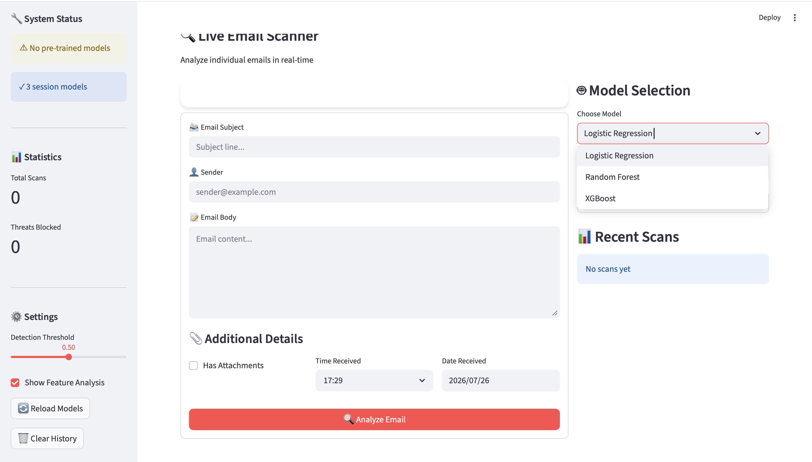
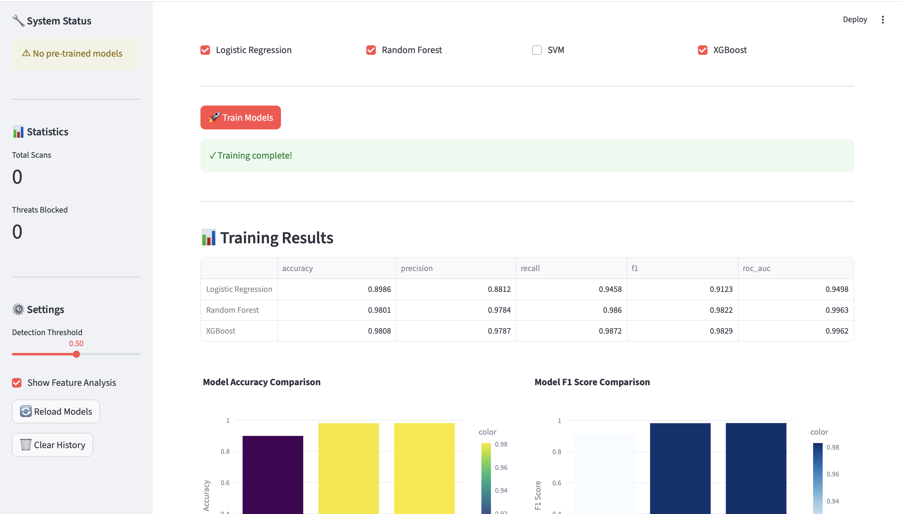
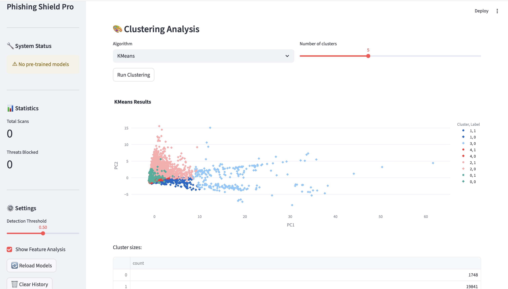
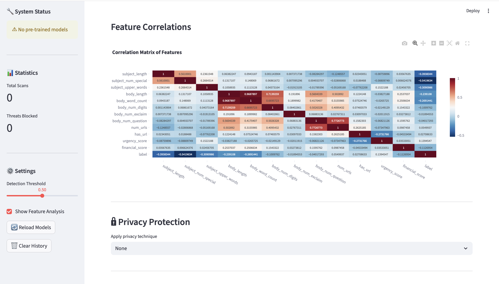

# 📧 Phishing Shield Pro
### Machine Learning-Based Email Phishing Detection System


A comprehensive **Machine Learning-based Email Phishing Detection System** that analyses email content and predicts whether an email is **Legitimate** or **Phishing** using multiple classification algorithms.

The application provides an interactive **Streamlit dashboard** for training models, analysing feature relationships, visualising clustering results, and scanning emails in real time.

---

# 🚀 Features

- 📧 Live Email Scanner
- 🤖 Multiple Machine Learning Models
- 📊 Model Performance Comparison
- 📈 Interactive Visualisations
- 🎨 Clustering Analysis
- 🔍 Feature Engineering
- 🔒 Privacy-Preserving Data Processing
- 📉 Correlation Heatmaps
- 📋 Prediction History
- ⚡ Streamlit Web Interface

---

# 🖥 Application Preview

## 📧 Live Email Scanner

Analyse emails in real time using any trained model.



---

## 🤖 Model Training & Evaluation

Train multiple models simultaneously and compare their performance.



---

## 🎨 Clustering Analysis

Explore hidden structures within the email dataset using unsupervised learning algorithms.



---

## 📊 Feature Correlation Analysis

Visualise feature relationships through an interactive correlation heatmap.



---

# 📖 Overview

Email phishing remains one of the most common cybersecurity threats.

This project combines feature engineering with traditional machine learning algorithms to classify emails as **Phishing** or **Legitimate**. It also includes exploratory data analysis, clustering techniques, privacy-preserving preprocessing, and a user-friendly dashboard for experimentation.

---

# 🧠 Machine Learning Workflow

```text
Raw Email
     │
     ▼
Data Cleaning
     │
     ▼
Feature Engineering
     │
     ▼
Model Training
(Logistic Regression / Random Forest / SVM / XGBoost)
     │
     ▼
Performance Evaluation
     │
     ▼
Live Email Prediction
```

---

# 📂 Project Structure

```
EmailPhisingDetectionModel/
│
├── data/
│   └── CEAS_08.csv
│
├── datacleaning.py
├── feature_engineering_and_eda.py
├── clustering_and_grouping.py
├── privacy_preserving.py
├── modelandevaluationmetrics.py
├── main.py
├── requirements.txt
└── README.md
```

---

# 🛠 Technologies Used

### Programming

- Python

### Machine Learning

- Scikit-Learn
- XGBoost

### Data Processing

- Pandas
- NumPy

### Visualisation

- Plotly
- Matplotlib
- Seaborn

### Web Framework

- Streamlit

---

# 📊 Dataset

The project uses the **CEAS 2008 Email Dataset**, containing both phishing and legitimate emails.

The dataset is used for:

- Data Cleaning
- Feature Engineering
- Model Training
- Performance Evaluation
- Clustering Analysis

---

# 🔍 Feature Engineering

The system extracts informative features including:

### Subject Features

- Subject Length
- Number of Special Characters
- Uppercase Word Count

### Body Features

- Email Length
- Word Count
- Number of Digits
- Number of URLs
- Exclamation Marks
- Question Marks

### Security Features

- Suspicious URL Detection
- Urgency Score
- Financial Keyword Score
- Presence of Hyperlinks

---

# 🤖 Machine Learning Models

The application supports:

- Logistic Regression
- Random Forest
- Support Vector Machine (SVM)
- XGBoost

Users can train multiple models simultaneously and compare their performance.

---

# 📈 Model Performance

| Model | Accuracy | Precision | Recall | F1 Score | ROC-AUC |
|--------|---------:|----------:|-------:|---------:|--------:|
| Logistic Regression | **89.86%** | 88.12% | 94.58% | 91.23% | 94.98% |
| Random Forest | **98.01%** | 97.84% | 98.60% | 98.22% | 99.63% |
| XGBoost | **98.08%** | 97.87% | 98.72% | 98.29% | 99.62% |

**Best Performing Model:** **XGBoost**

---

# 🎨 Clustering Analysis

The project also explores unsupervised learning through:

- K-Means
- DBSCAN
- Agglomerative Clustering
- Spectral Clustering
- BIRCH
- OPTICS

These algorithms help identify hidden behavioural patterns within the dataset.

---

# 🔒 Privacy Protection

Sensitive information is protected through privacy-preserving preprocessing techniques before model training and prediction.

---

# 🚀 Installation

Clone the repository

```bash
git clone https://github.com/Beastly12/EmailPhisingDetectionModel.git
```

Move into the project directory

```bash
cd EmailPhisingDetectionModel
```

Install dependencies

```bash
pip install -r requirements.txt
```

---

# ▶ Running the Application

Launch the Streamlit app

```bash
streamlit run main.py
```

or

```bash
python -m streamlit run main.py
```

Then open:

```
http://localhost:8501
```

---

# 📋 How to Use

1. Launch the Streamlit application.
2. Train one or more machine learning models.
3. Select the desired prediction model.
4. Enter:
   - Email Subject
   - Sender
   - Email Body
   - Additional metadata (optional)
5. Click **Analyze Email**.
6. Review the prediction and supporting analysis.

---

# 📌 Future Improvements

- Deep Learning (LSTM / BERT)
- Explainable AI (SHAP / LIME)
- REST API Deployment
- Docker Support
- Cloud Deployment
- Browser Extension
- Email Client Integration
- Continuous Model Retraining

---

# 🤝 Contributing

Contributions are welcome.

If you have ideas for improvements:

1. Fork the repository
2. Create a new feature branch
3. Commit your changes
4. Submit a Pull Request

---

# 👨‍💻 Author

**Dafe Edesiri Otudje**

GitHub:
https://github.com/Beastly12

---

# ⭐ Support

If you found this project useful, consider giving it a ⭐ on GitHub.

It helps others discover the project and motivates future improvements.
